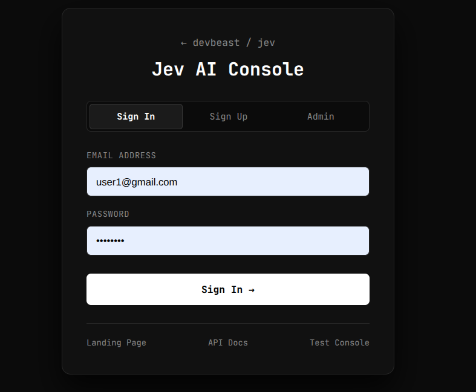
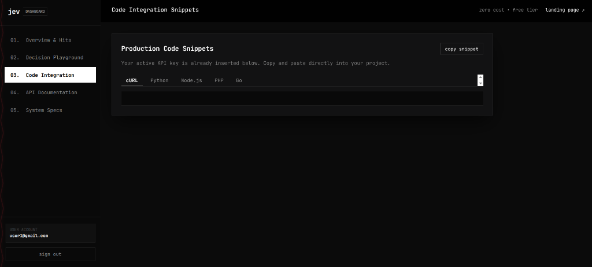
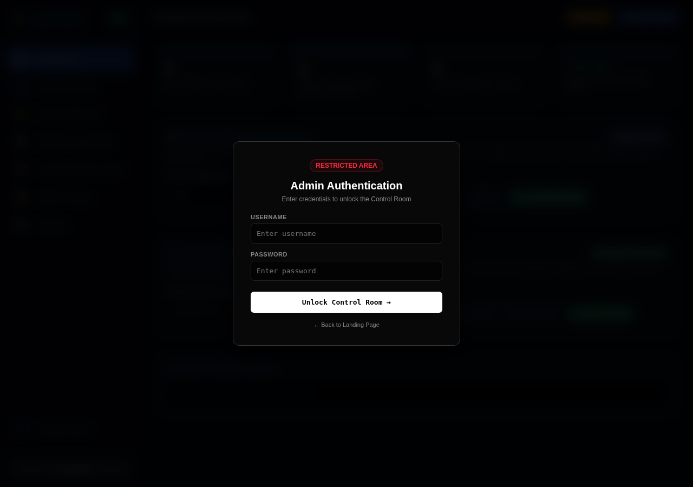
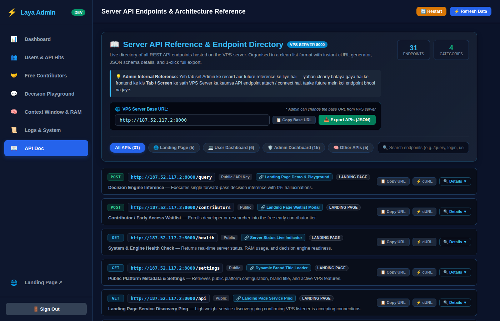

# Laya / Jev AI — Clone Prompts & Deployment Package

> **Obsidian Noir | System 1 Decision Engine | ModernBERT | FastAPI + SQLite**

A complete, ready-to-deploy clone of the **Laya / Jev AI** platform — a non-autoregressive AI decision engine that classifies context, scores intent, and evaluates boolean decisions in a single forward pass (no text generation, no hallucinations).

This repo contains everything you need to spin up your own copy on either a **VPS** or **cPanel / Hostinger shared hosting** — including the full frontend code, PHP proxy, and detailed clone prompts.

---

## 🗂️ Repo Structure

```
cloning-prompts/
└── laya-ai/
    ├── README.md                 ← You are here
    ├── CLONE_FOR_VPS.md          ← Full A-to-Z VPS clone prompt + deployment manual
    ├── CLONE_FOR_CPANEL.md       ← Full cPanel/Hostinger clone prompt + deployment guide
    ├── screenshots/              ← UI screenshots
    └── laya_hostinger/           ← Complete frontend code (upload directly to public_html/)
        ├── index.html            ← Landing page with live decision sandbox
        ├── dashboard.html        ← User developer console (5 tabs)
        ├── login.html            ← User authentication
        ├── admin.html            ← Admin control room + Attached APIs tab
        ├── test.html             ← Decision test playground
        ├── api.html              ← API explorer
        ├── config.js             ← Central API config (set your VPS IP here)
        ├── api_proxy.php         ← PHP reverse proxy (bypasses CORS & mixed content)
        ├── .htaccess             ← Clean URLs, HTTPS redirect, Gzip
        ├── robot.png             ← Transparent AI robot hero image
        └── sitemap.xml / robots.txt
```

---

## 🚀 Quick Start

### Option A — VPS (Full Stack with AI Backend)
Read **[CLONE_FOR_VPS.md](./CLONE_FOR_VPS.md)** — contains:
- One-prompt master clone directive for any AI coding assistant
- AI model setup (ModernBERT, HuggingFace `devbeast/laya`)
- PM2 + Nginx + SSL deployment steps
- Complete REST API reference
- SQLite database schema

### Option B — cPanel / Hostinger (Frontend Only, connects to remote VPS)
Read **[CLONE_FOR_CPANEL.md](./CLONE_FOR_CPANEL.md)** — contains:
- One-prompt master clone directive for shared hosting
- How to upload `laya_hostinger/` to `public_html/`
- PHP proxy explanation
- Critical bug warnings (see below)
- Pre-flight checklist

---

## ⚡ One-Step Deploy (cPanel / Hostinger)

1. Download this repo as ZIP
2. Extract `laya_hostinger/` contents into your `public_html/`
3. Edit `config.js` — set your VPS IP:
   ```javascript
   API_BASE_URL: "http://YOUR_VPS_IP:8000",
   ```
4. Done. Visit your domain.

---

## 🖥️ Screenshots

### Landing Page


### User Dashboard — Code Integration Tab


### Admin Control Room


### Admin — Attached VPS APIs Tab


---

## 🎨 Design System — Obsidian Noir

| Property | Value |
| :--- | :--- |
| Background | `#000000` / `#030303` / `#080808` |
| Borders | `#222222` |
| Text | `#ffffff` / `#888888` |
| Accent | `#ff2a3d` (left zigzag only, 13% opacity) |
| Typography | JetBrains Mono (Google Fonts) |
| Hero Asset | `robot.png` — transparent ASCII AI robot, floating animation |

---

## 🤖 AI Engine Specs

| Feature | Detail |
| :--- | :--- |
| Architecture | System 1 Non-Autoregressive (ModernBERT backbone) |
| Latency | 12ms–25ms CPU / <5ms GPU |
| Query Types | `noul` (boolean), `choice` (multi-class), `score` (0–100) |
| HuggingFace | `devbeast/laya` / `devbeast/jev` |
| Backend | FastAPI + Uvicorn + SQLite |
| Auth | JWT session tokens + API key (`sk_live_...`) |

---

## 📡 Key API Endpoints

| Endpoint | Method | Purpose |
| :--- | :--- | :--- |
| `/query` | `POST` | Core AI decision inference |
| `/user/signup` | `POST` | Register + get API key |
| `/user/login` | `POST` | Authenticate user |
| `/user/me` | `GET` | Profile + usage hits |
| `/user/api-key/rotate` | `POST` | Rotate API key |
| `/admin/metrics` | `GET` | CPU, RAM, PM2 uptime |
| `/settings` | `GET` | Brand, context window, API URL |
| `/health` | `GET` | Server uptime check |

---

## ⚠️ Known Gotcha — PHP Tag in HTML Files

> **Critical for shared hosting clones.**

Apache/LiteSpeed on cPanel/Hostinger parses `.html` files through PHP. Writing literal `<?php` inside a JavaScript string **breaks all JavaScript** after that point — buttons stop working, snippets stay blank.

**Always use:**
```javascript
// WRONG:
return "<?php\n" + ...

// CORRECT:
return "<" + "?php\n" + ...
```
This is already fixed in all files in this package. If you build a new clone, remember this rule.

---

## 📄 License

MIT — clone freely, build your own.
